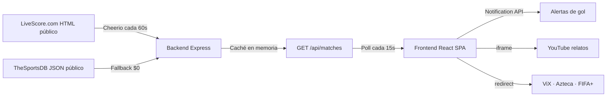

# Tobalazo · Mundial 2026 en vivo ($0)

SPA para seguir el Mundial de Fútbol 2026 con marcadores en tiempo real, relatos en YouTube y enlaces a transmisiones oficiales gratuitas.

## Arquitectura (flujo de datos gratuito)



1. **Origen primario:** [SportsAPIPro V4](https://v4.football.sportsapipro.com) — endpoints `/api/v1/world-cup/*` con header `x-api-key`.
2. **Fallback:** API-Football o scraping LiveScore + TheSportsDB.
3. **Caché:** Un `setInterval` de 60 segundos actualiza la caché en memoria. El frontend **nunca** consulta la API externa directamente.
4. **Video:** Reproductor embebido con **9 canales por partido** (UX tipo agregador). Cada canal abre una búsqueda en YouTube dentro de la app — sin redirigir a ViX ni sitios externos.
5. **Goles:** Al detectar cambio de marcador en partidos "En Vivo", dispara `new Notification(...)`.

## Modelo `Match`

```json
{
  "id": "1417909",
  "teamA": { "name": "Mexico", "abbr": "MEX", "goals": 2, "flag": "https://..." },
  "teamB": { "name": "South Africa", "abbr": "RSA", "goals": 0, "flag": "https://..." },
  "minute": "FT",
  "status": "Finalizado",
  "kickoffTime": "2026-06-11T19:00:00Z",
  "kickoffDate": "2026-06-11",
  "stage": "Group A",
  "venue": "Estadio Azteca",
  "youtubeQuery": "relato en vivo mundial 2026 Mexico vs South Africa"
}
```

Estados válidos: `"Por empezar"`, `"En Vivo"`, `"Finalizado"`.

## Estructura del proyecto

```
Tobalazo/
├── backend/          # Express + Cheerio + caché 60s
│   └── src/
│       ├── scraper.js
│       ├── cache.js
│       ├── routes/api.js
│       └── index.js
└── frontend/         # Vite + React + Tailwind
    └── src/
        ├── components/LiveViewer.jsx
        ├── components/MatchChannels.jsx
        └── App.jsx
```

## Desarrollo local

### Backend

```bash
cd backend
cp .env.example .env
npm install
npm run dev
```

Servidor: `http://localhost:3001`

### Frontend

```bash
cd frontend
cp .env.example .env
npm install
npm run dev
```

App: `http://localhost:5173`

## Despliegue

### Railway (backend + streamer) — recomendado

1. Sube el repo a GitHub.
2. En [railway.app](https://railway.app) crea un proyecto con **dos servicios** del mismo repo:
   - **tobis-backend** → Root Directory: `backend`
   - **tobis-streamer** → Root Directory: `streamer` (mín. **1 GB RAM**)
3. En cada servicio: **Settings → Networking → Generate Domain**.
4. Variables:
   - Ambos: `FRONTEND_URL=https://tu-app.vercel.app`
   - Backend: `SPORTSAPI_KEY`, `LIVESCORE_LOCALE=en`
5. Desde terminal (opcional):

```powershell
powershell -ExecutionPolicy Bypass -File .\scripts\railway-setup.ps1
```

6. En Vercel (frontend):

```env
VITE_API_URL=https://tobis-backend-xxxx.up.railway.app
VITE_STREAMER_API=https://tobis-streamer-xxxx.up.railway.app
```

### Backend en Render (alternativa gratis)

1. Sube el repo a GitHub.
2. En [render.com](https://render.com) → **New Web Service**.
3. Conecta el repo, **Root Directory:** `backend`.
4. **Build Command:** `npm install`
5. **Start Command:** `npm start`
6. Variables de entorno:
   - `FRONTEND_URL` = URL de Vercel (ej. `https://tobalazo.vercel.app`)
   - `SCRAPE_INTERVAL_MS` = `60000`
   - `LIVESCORE_LOCALE` = `en` o `es`
7. Deploy. Anota la URL: `https://tobalazo-api.onrender.com`

> Render free tier puede dormir tras inactividad; la primera petición tarda ~30s.

### 2. Frontend en Vercel (gratis)

1. En [vercel.com](https://vercel.com) → **Add New Project**.
2. Importa el repo, **Root Directory:** `frontend`.
3. **Framework Preset:** Vite
4. Variable de entorno:
   - `VITE_API_URL` = `https://tobalazo-api.onrender.com`
5. Deploy.

### 3. Alternativa frontend: Netlify

1. **Base directory:** `frontend`
2. **Build command:** `npm run build`
3. **Publish directory:** `dist`
4. Env: `VITE_API_URL` igual que arriba.

### 4. CORS

El backend ya permite el origen configurado en `FRONTEND_URL`. Tras desplegar Vercel, actualiza esa variable en Render y redeploy.

## Endpoints

| Método | Ruta | Descripción |
|--------|------|-------------|
| GET | `/api/health` | Health check |
| GET | `/api/worldcup/today?date=2026-06-11` | **Endpoint principal** — partidos + presupuesto API |
| GET | `/api/matches?date=2026-06-11` | Caché en memoria (compatibilidad) |
| GET | `/api/standings` | Clasificación 12 grupos |
| GET | `/api/streams` | Enlaces oficiales de transmisión |

## Presupuesto API inteligente (100 llamadas/día)

El backend administra el límite diario con caché en `backend/data/`:

| Módulo | Funciones |
|--------|-----------|
| `services/apiBudget.js` | `getDailyApiBudget`, `incrementDailyApiUsage`, `resetDailyApiBudgetIfNeeded` |
| `services/matchCache.js` | `getCachedMatches`, `saveCachedMatches` |
| `services/localSchedule.js` | `getTodayMatchesLocal` (calendario local sin API) |
| `services/refreshPolicy.js` | `isMatchProbablyLive`, `getRecommendedRefreshInterval`, `shouldCallApi` |
| `services/worldCupSync.js` | `updateWorldCupData` |

**Endpoint principal del frontend:** `GET /api/worldcup/today?date=YYYY-MM-DD`

- 1 llamada API = todos los partidos del día (`/api/v1/world-cup/matches?date=`)
- Reinicio diario del contador (zona `America/Mexico_City`)
- Frecuencia adaptativa: 3h programados · 10–15 min pre-partido · 3–5 min en vivo · 1–3 min finales
- Si se agotan las 100 llamadas: último caché + mensaje discreto en UI

Variables:

```env
SPORTSAPI_KEY=tu_clave
API_DAILY_LIMIT=100
```

## Ver partidos en vivo (dentro de la app)

Cada partido incluye **9 canales** (`Canal 1` … `Canal 9`, algunos HD) generados dinámicamente con búsquedas de YouTube embebidas:

- Relato en español / inglés
- Cobertura TV deportiva (Azteca, Telemundo, FIFA+)
- Minuto a minuto

**Uso:** haz clic en un partido → elige un canal → el reproductor se carga arriba sin salir de Tobalazo.

> No se scrapean agregadores de streams pirata (Rojadirecta, etc.). Los canales apuntan a contenido público embebible en YouTube.

## Licencia

MIT
